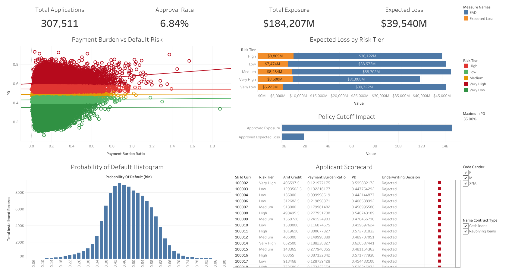
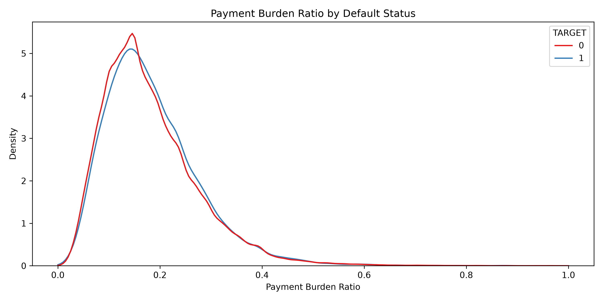
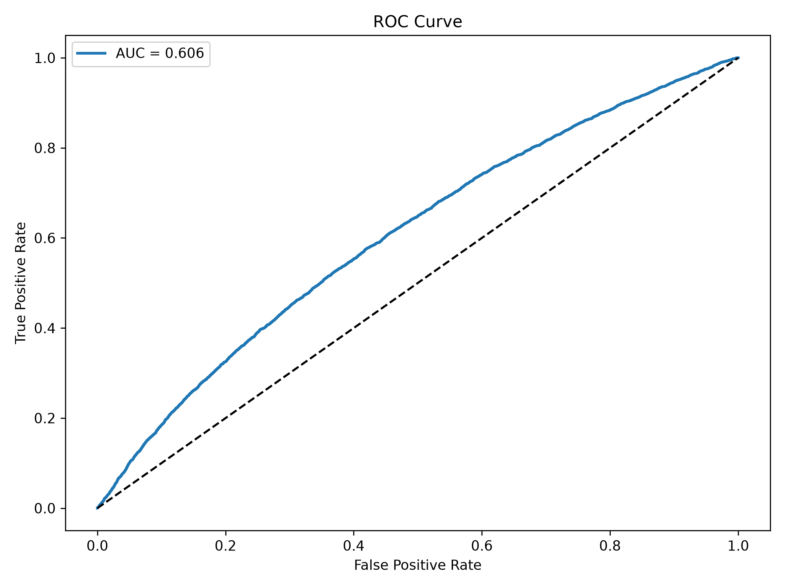
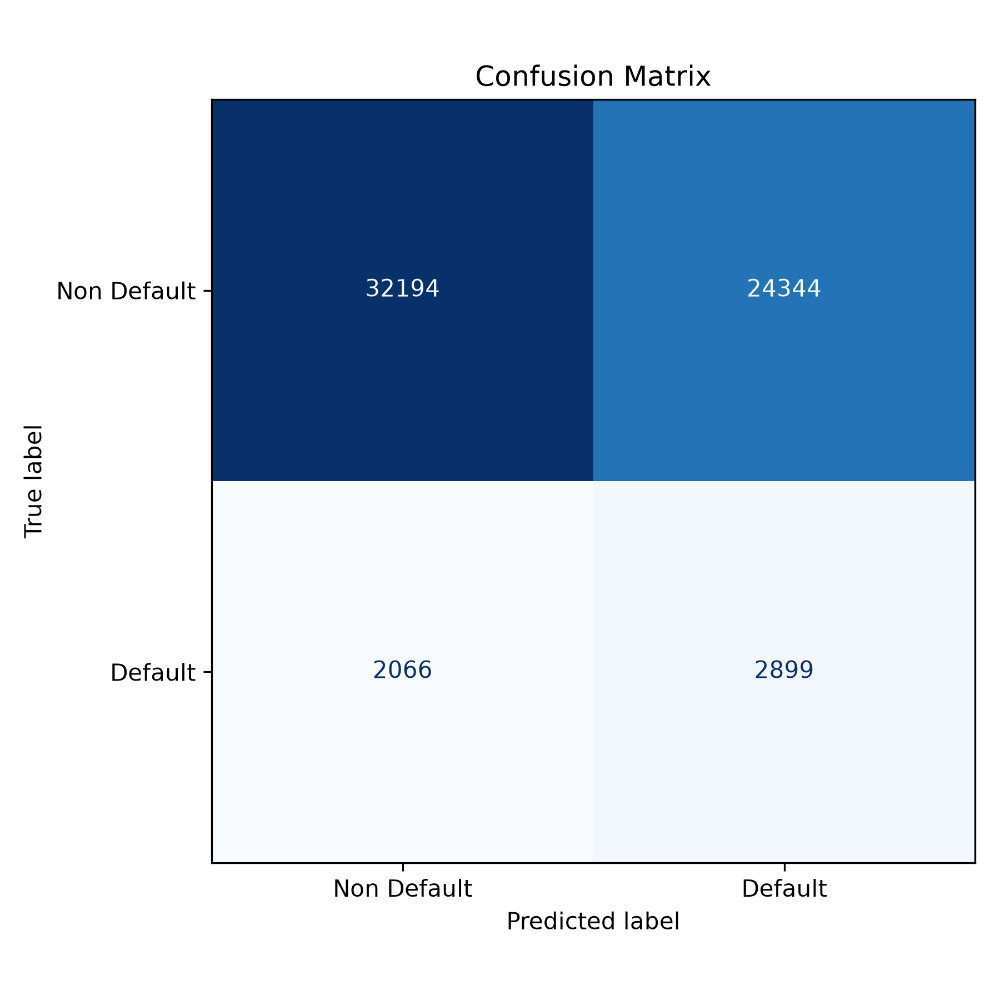
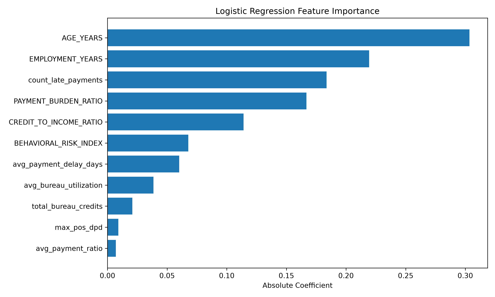

# Unbanked Alternative Credit Underwriting & Default Risk Profiling Pipeline


---



---

## Executive Summary

Traditional credit scoring models rely heavily on historical credit bureau information, making it difficult to accurately assess applicants with limited or no formal credit history. This project develops an end-to-end alternative credit underwriting pipeline that combines demographic, financial, and behavioral repayment data to estimate each applicant's **Probability of Default (PD)** and calculate **Expected Credit Loss (ECL)** for portfolio risk management.

The pipeline integrates SQL-based feature engineering in DuckDB, machine learning using Logistic Regression, financial risk modeling, and interactive Tableau dashboards to support data-driven underwriting decisions.

---

## Business Problem

Traditional lending institutions often reject potentially creditworthy applicants because they lack sufficient credit history. This leads to:

- Missed lending opportunities
- Higher portfolio risk due to inaccurate pricing
- Financial exclusion of unbanked customers

This project demonstrates how behavioral repayment information can supplement traditional financial variables to build a more robust credit risk model.

---

## Objectives

- Build a scalable credit underwriting pipeline using relational financial data.
- Engineer alternative behavioral risk features.
- Predict the Probability of Default (PD) using Logistic Regression.
- Calculate portfolio Expected Credit Loss (ECL).
- Develop an interactive Tableau dashboard for underwriting decisions.

---

# Technical Stack

| Category | Tools |
|----------|------|
| Database | DuckDB |
| SQL | Common Table Expressions (CTEs), Aggregations, Joins |
| Programming | Python |
| Data Processing | Pandas, NumPy |
| Machine Learning | Scikit-Learn |
| Visualization | Tableau Public |
| Statistical Visualization | Matplotlib, Seaborn |
| Financial Modeling | Microsoft Excel |
| Model Serialization | Joblib |

---

# Original Data Source

This project uses the **Home Credit Default Risk** dataset, which was originally published as part of a Kaggle machine learning competition.

**Dataset:** Home Credit Default Risk

**Kaggle:** https://www.kaggle.com/competitions/home-credit-default-risk

### Required Files

Download the following CSV files from the competition and place them inside the project's `data/` directory before running the pipeline:

```
data/
├── application_train.csv
├── bureau.csv
├── POS_CASH_balance.csv
└── installments_payments.csv
```

The pipeline utilizes the following relational tables:

| Dataset | Description |
|----------|-------------|
| application_train.csv | Applicant demographic and loan application information |
| bureau.csv | Previous credit bureau records |
| POS_CASH_balance.csv | Point-of-sale and cash loan monthly balances |
| installments_payments.csv | Historical installment repayment records |

> **Note:** The original dataset is **not included** in this repository because it is distributed under Kaggle's licensing terms. Users must download the data directly from Kaggle after accepting the competition rules.

---

# Project Architecture

```
Raw CSV Files
        │
        ▼
DuckDB SQL Staging
        │
        ▼
Feature Engineering
        │
        ▼
Logistic Regression Model
        │
        ▼
Probability of Default (PD)
        │
        ▼
Expected Credit Loss (ECL)
        │
        ▼
Tableau Underwriting Dashboard
```

---

# Repository Structure

```
unbanked-credit-underwriting-pipeline/
│
├── README.md
│
├── 01_db_staging_and_sql.py
├── 02_risk_scoring_and_diagnostics.py
├── 03_expected_credit_loss.py
│
├── data/
│   ├── credit_risk_features.csv
│   └── credit_underwriting_scored.csv
│
├── assets/
│   ├── payment_burden_density.png
│   ├── roc_curve.png
│   ├── confusion_matrix.png
│   └── feature_importance.png
│
├── excel/
│   └── portfolio_credit_loss_model.xlsx
│
├── models/
│   ├── logistic_regression.pkl
│   ├── imputer.pkl
│   └── scaler.pkl
│
├── tableau/
│   └── underwriting_dashboard.twbx
│
└── requirements.txt
```

---

# Feature Engineering

The pipeline creates several underwriting features including:

### Financial Ratios

- Payment Burden Ratio
- Credit-to-Income Ratio

### Demographic Features

- Applicant Age
- Employment Duration

### Behavioral Features

- Average Payment Delay
- Maximum Payment Delay
- Number of Late Payments
- Average Payment Ratio
- POS Delinquency
- Bureau Credit Utilization
- Bureau Overdue Counts

### Composite Feature

Behavioral Risk Index

```
Behavioral Risk Index =
1.5 × Late Payments
+ 0.8 × Average Payment Delay
+ 2 × Bureau Overdues
```

---

# Machine Learning Model

Model Used:

- Logistic Regression

Preprocessing:

- Median Imputation
- Standard Scaling

Training:

- 80/20 Train-Test Split
- Stratified Sampling
- Balanced Class Weights

Outputs:

- Probability of Default (PD)
- Risk Tier Classification

---

# Risk Tiers

Applicants are segmented into five underwriting categories based on predicted default probability.

| Risk Tier | Description |
|-----------|-------------|
| Very Low | Lowest predicted risk |
| Low | Low default probability |
| Medium | Moderate credit risk |
| High | Elevated credit risk |
| Very High | Highest predicted risk |

---

# Expected Credit Loss (ECL)

Expected Credit Loss is calculated using:

```
ECL = PD × EAD × LGD
```

Where

- PD = Probability of Default
- EAD = Exposure at Default
- LGD = 45%

The portfolio summary includes:

- Total Applicants
- Average PD
- Total Exposure
- Total Expected Loss
- ECL Provision Ratio

---

# Tableau Dashboard

The Tableau dashboard functions as an Underwriting Command Center.

### Dashboard Components

### Executive KPIs

- Total Applicants
- Approval Rate
- Average PD
- Portfolio Expected Loss

### Applicant Scorecard

Displays:

- Applicant ID
- Income
- Credit Amount
- Payment Burden Ratio
- PD
- Risk Tier
- Decision

### Portfolio Analysis

- Risk Tier Distribution
- Exposure vs Expected Loss
- Income vs Default Probability Scatter Plot

### Interactive Filters

- Gender
- Contract Type
- Risk Tier

### Dynamic Underwriting Parameter

Maximum Allowable Probability of Default (PD)

This parameter dynamically updates:

- Approved Applicants
- Rejected Applicants
- Approval Rate
- Portfolio Risk

---

# Model Evaluation

The project evaluates model performance using:

### Payment Burden Density



---

### ROC Curve



---

### Confusion Matrix



---

### Feature Importance



---

# Installation

Clone the repository

```bash
git clone https://github.com/yourusername/unbanked-credit-underwriting-pipeline.git
```

Install dependencies

```bash
pip install -r requirements.txt
```

---

# Running the Pipeline

Run the scripts in the following order.

### Step 1

```bash
python 01_db_staging_and_sql.py
```

Loads relational datasets into DuckDB and performs SQL feature aggregation.

---

### Step 2

```bash
python 02_risk_scoring_and_diagnostics.py
```

Performs:

- Feature Engineering
- Logistic Regression Training
- PD Estimation
- ROC Curve
- Confusion Matrix
- Feature Importance
- Model Serialization

Outputs:

```
credit_underwriting_scored.csv

roc_curve.png

confusion_matrix.png

feature_importance.png

payment_burden_density.png

logistic_regression.pkl
```

---

### Step 3

```bash
python 03_expected_credit_loss.py
```

Calculates:

- Exposure at Default
- Probability of Default
- Expected Credit Loss
- Portfolio Summary

Exports:

```
portfolio_credit_loss_model.xlsx
```

---

# Key Results

- Engineered alternative behavioral credit features from over **25 million** repayment records.
- Built a supervised Logistic Regression model to estimate applicant default probability.
- Generated applicant-level Probability of Default and risk segmentation.
- Calculated portfolio Expected Credit Loss using IFRS 9-inspired methodology.
- Delivered an interactive Tableau dashboard for underwriting decision support.

---

# Future Improvements

- Gradient Boosting (XGBoost, LightGBM)
- SHAP Explainability
- Hyperparameter Optimization
- Cross Validation
- Probability Calibration
- Model Monitoring Dashboard
- API Deployment using FastAPI
- Automated ETL Scheduling

---

# Author

**Devdatta Mondal**

Data Analyst | Marketing Analytics | SQL | Python | Tableau | Excel

- LinkedIn: *(https://www.linkedin.com/in/devdatta-mondal/)*
- Tableau Public: *(https://public.tableau.com/app/profile/devdatta.mondal/viz/UnbankedAlternativeCreditUnderwritingandDefaultRiskProfilingPipeline/Dashboard1)*
- GitHub: *(https://github.com/DevdattaMondal)*
---

# License

This project is intended for educational and portfolio purposes only.

The Home Credit Default Risk dataset is subject to Kaggle's licensing terms and is **not redistributed** in this repository.
